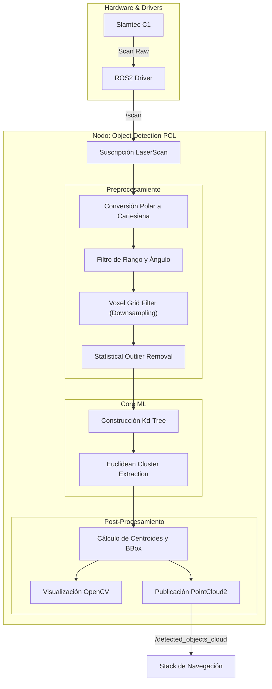

# Documentación Técnica Avanzada: Nodo de Detección de Objetos (Lidar PCL)

Este documento presenta un análisis exhaustivo, teórico y práctico del sistema de percepción implementado para el robot **Yahboom ROSMASTER A1**. Se detalla la fundamentación matemática de los algoritmos de Aprendizaje Automático No Supervisado utilizados para procesar las nubes de puntos del sensor **Slamtec C1**.

## 1. Contextualización del Problema

### 1.1 El Desafío de la Percepción en Robótica Móvil
El robot opera en entornos no estructurados donde la posición y geometría de los obstáculos son desconocidas *a priori*. El sensor LiDAR Slamtec C1 proporciona una representación discreta del entorno mediante un conjunto de puntos $P = \{p_1, p_2, ..., p_n\}$ en coordenadas polares $(r, \theta)$.

El problema fundamental es la **segmentación semántica no supervisada**: transformar este conjunto de puntos crudos $P$ en un conjunto de subconjuntos disjuntos $C = \{C_1, C_2, ..., C_k\}$, donde cada $C_i$ representa un objeto físico distinto (e.g., una pared, una persona, una caja).

### 1.2 Justificación del Enfoque de ML
Dado que no existen etiquetas de entrenamiento (ground truth) en tiempo real, se descartan los métodos supervisados. Se requiere un enfoque de **Clustering Basado en Densidad**, ya que los objetos físicos se manifiestan como regiones de alta densidad de puntos separadas por regiones de baja densidad (espacio vacío).

---

## 2. Fundamentación Teórica y Algorítmica

### 2.1 Preprocesamiento y Filtrado
Antes de la segmentación, los datos deben ser limpiados para reducir la complejidad computacional y eliminar errores de medición.

#### A. Filtrado Voxel Grid (Downsampling)
Para reducir la cantidad de puntos $N$ sin perder la estructura geométrica, se aplica un filtro de rejilla de vóxeles.
*   **Concepto:** El espacio 3D se divide en cubos (vóxeles) de tamaño $V_{size} \times V_{size} \times V_{size}$.
*   **Operación:** Todos los puntos dentro de un vóxel se reemplazan por su centroide $\bar{p}$.
    $$ \bar{p} = \frac{1}{m} \sum_{i=1}^{m} p_i $$
    Donde $m$ es el número de puntos en el vóxel.
*   **Impacto en Código:** Controlado por `voxel_leaf_size_` (0.02m). Esto reduce drásticamente $N$, permitiendo que el algoritmo de clustering posterior corra en tiempo real.

#### B. Statistical Outlier Removal (Eliminación de Ruido)
El sensor LiDAR a menudo genera "puntos fantasma" debido a reflejos especulares o bordes de objetos.
*   **Algoritmo:** Para cada punto $p_i$, se calcula la distancia media $\bar{d}_i$ a sus $k$ vecinos más cercanos.
*   **Criterio de Eliminación:** Un punto se descarta si su distancia media es mayor que un umbral definido por la media global $\mu_k$ y la desviación estándar $\sigma_k$ de todas las distancias:
    $$ \text{Descartar si: } \bar{d}_i > \mu_k + \alpha \cdot \sigma_k $$
*   **Parámetros en Código:**
    *   $k$ = `outlier_mean_k` (10 vecinos).
    *   $\alpha$ = `outlier_stddev` (0.5 desviaciones estándar).

### 2.2 Núcleo de ML: Euclidean Cluster Extraction (DBSCAN)
El algoritmo implementado es una variante eficiente de **DBSCAN (Density-Based Spatial Clustering of Applications with Noise)**. A diferencia de K-Means, este algoritmo agrupa puntos basándose en la conectividad espacial directa.

#### Formulación Matemática
Sea $d(p_i, p_j)$ la distancia euclidiana entre dos puntos:
$$ d(p_i, p_j) = \sqrt{(x_i-x_j)^2 + (y_i-y_j)^2 + (z_i-z_j)^2} $$

Un cluster $C$ se define como un conjunto de puntos tal que para todo $p \in C$, existe otro punto $q \in C$ que cumple:
$$ d(p, q) < \epsilon $$
Donde $\epsilon$ es la tolerancia de distancia (radio de búsqueda).

#### Algoritmo Implementado (PCL)
1.  Se selecciona un punto semilla $p$ no procesado.
2.  Se buscan todos los vecinos $N_\epsilon(p)$ tal que $d(p, n) < \epsilon$.
3.  Si el número de vecinos $|N_\epsilon(p)| \ge MinPts$, se crea un nuevo cluster.
4.  Se repite el proceso recursivamente para cada vecino, expandiendo el cluster hasta que no se encuentren más puntos conectados por la distancia $\epsilon$.

#### Optimización con Kd-Tree
La búsqueda ingenua de vecinos tiene una complejidad de $O(N^2)$. Para hacer esto viable en el robot, se utiliza una estructura de datos **Kd-Tree (k-dimensional tree)**.
*   Esto reduce la complejidad de búsqueda del vecino más cercano a $O(\log N)$.
*   **Complejidad total del algoritmo:** $O(N \log N)$.

---

## 3. Implementación: Mapeo de Teoría a Código

La siguiente tabla relaciona los conceptos teóricos explicados con las variables específicas en `object_detection_pcl.cpp`:

| Concepto Teórico | Variable en Código | Valor Configurado | Explicación |
| :--- | :--- | :--- | :--- |
| **Radio de Búsqueda ($\epsilon$)** | `cluster_tolerance_` | `0.15` (metros) | Distancia máxima entre puntos para considerarlos parte del mismo objeto. Si dos puntos están a más de 15cm, se consideran objetos separados. |
| **Densidad Mínima ($MinPts$)** | `min_cluster_size_` | `3` (puntos) | Mínimo de puntos para formar un cluster válido. Ayuda a filtrar ruido residual que no fue eliminado por el filtro estadístico. |
| **Tamaño Máximo** | `max_cluster_size_` | `10000` (puntos) | Evita que el algoritmo agrupe todo el entorno (e.g., paredes largas) como un único objeto inmanejable. |
| **Región de Interés (ROI)** | `range_min_`, `range_max_` | `0.1`m - `16.0`m | Filtra puntos demasiado cercanos (ruido del propio chasis) o demasiado lejanos (fuera de relevancia para navegación local). |

---

## 4. Análisis Comparativo: ¿Por qué no K-Means?

Es crucial justificar por qué se eligió un método basado en densidad sobre el popular K-Means.

### 1. Conocimiento a Priori del Entorno
*   **K-Means:** Requiere definir $K$ (número de clusters) antes de ejecutar.
    *   *Problema:* En navegación, el robot no sabe si tiene enfrente 1, 5 o 0 obstáculos. Un $K$ incorrecto forzaría al algoritmo a dividir una pared en dos objetos o fusionar dos sillas en una.
*   **DBSCAN/Euclidean:** No requiere $K$. Descubre el número de objetos automáticamente basado en la estructura de los datos.

### 2. Geometría de los Objetos
*   **K-Means:** Asume que los clusters son convexos (esféricos) e isotrópicos. Utiliza la distancia al centroide.
    *   *Problema:* Una pared larga y delgada sería mal clasificada por K-Means, ya que los puntos en los extremos están lejos del centroide.
*   **DBSCAN/Euclidean:** Basado en conectividad local. Puede seguir formas arbitrarias (serpenteantes, líneas, "U" shapes) perfectamente, lo cual es ideal para paredes y esquinas.

### 3. Robustez al Ruido
*   **K-Means:** Es sensible a outliers. Un solo punto de ruido lejos de los objetos desplazará significativamente el centroide del cluster más cercano.
*   **DBSCAN/Euclidean:** Tiene una noción explícita de "ruido". Los puntos que no cumplen el criterio de densidad no se asignan a ningún cluster, resultando en una detección mucho más limpia.

## 5. Flujo de Datos del Nodo



## 6. Instrucciones de Uso

1.  **Iniciar Hardware:**
    ```bash
    ros2 launch sllidar_ros2 sllidar_c1_launch.py
    ```
2.  **Ejecutar Nodo:**
    ```bash
    ros2 run object_detection object_detection_node
    ```
3.  **Ajuste de Parámetros (Runtime):**
    El nodo permite reconfiguración dinámica. Si el robot detecta "falsos positivos" (ruido como objetos), aumente `min_cluster_size` o reduzca `cluster_tolerance`.
    ```bash
    ros2 param set /object_detection_pcl min_cluster_size 5
    ```
